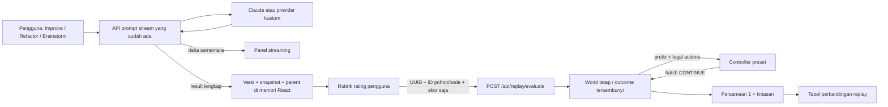

# Dream-RSI → Prisma: analisis dan artefak implementasi

## Status terkini: otomatis sejak generate pertama

Permintaan terbaru pengguna: Dream-RSI harus tertanam pada sistem dan system prompt, bukan menunggu penilaian manual di Replay Lab. Implementasi saat ini menjalankan pipeline **otomatis** pada `POST /api/prompt/stream` dan `/api/prompt/process`, untuk Improve, Refactor, dan Brainstorm, termasuk permintaan pertama dengan riwayat kosong.

1. Buat kandidat A, nilai dengan evaluator AI tetap.
2. Lanjutkan A menjadi B menggunakan diagnostik evaluasi, lalu nilai B.
3. Buka cabang independen C dan nilai C.
4. Bekukan pohon A→B dan akar C, gabungkan maksimal tiga world sesi sebelumnya untuk tugas/config yang sama, lalu bandingkan preset lewat Persamaan (1). Replay memakai K₂=2 agar urutan alokasi pada budget kecil dapat dibedakan; ties mempertahankan incumbent.
5. Terapkan preset terpilih pada aksi legal pohon online: lanjutkan frontier atau buka akar baru D, lalu evaluasi. Replay **tidak membatasi** aksi online hanya pada anak historis; outcome baru benar-benar dihasilkan melalui provider.
6. Pilih kandidat dengan skor AI tertinggi di antara yang lolos pemeriksaan batasan. Kandidat awal ikut dibandingkan; hasil yang lebih buruk tidak otomatis menggantikannya. Jika semuanya gagal pemeriksaan, tampilkan error dan pertahankan hasil terakhir.

Batas aplikasi: maksimal **4 generasi + 4 evaluasi = 8 panggilan tahap AI**, deadline total 240 detik, tiap panggilan maksimal 120 detik. Ini lebih mahal/lama dari single-pass. Angka panggilan menghitung tahap aplikasi, bukan retry internal SDK atau biaya token/tagihan. Tombol Hentikan membatalkan fetch dan membatalkan pipeline server saat disconnect. Semua kandidat di-stream sebagai kandidat sementara; hanya hasil terpilih menjadi versi final.

Artefak baru: `backend/rsi.py` (orkestrator/evaluator tetap), tambahan protokol di `backend/prompts.py`, `RsiSummary.js`, SSE `status`/`reset`, dan histori RSI tiga world terakhir di memori React. Node replay otomatis terpisah dari rating manual Replay Lab. **Pengguna tidak perlu memberi rating atau membuka Replay Lab untuk mengaktifkan RSI.**

Ini tetap **adaptasi bounded Dream-RSI**, bukan reproduksi penuh: preset dipilih, bukan kode policy ditulis ulang oleh LLM; langkah live berikutnya melanjutkan pohon request yang sama, bukan rollout baru penuh. Evaluator AI adalah proksi kualitas prompt, bukan evaluator eksekusi domain paper. Tidak ada training bobot, DB, atau klaim peningkatan pada dunia nyata.

### Kontrak tambahan endpoint generasi

`session_id` (UUID, dibuat server bila tidak dikirim), `rsi_history` (maksimal 3 `ReplayWorld`), dan `rsi_policy` (incumbent preset) opsional; **pipeline selalu otomatis** walau ketiganya tidak diberikan. Frontend hanya mengirim histori dengan identitas tugas/config yang sesuai. Setiap tahap provider memakai ID sesi ber-suffix request/node/stage agar percakapan kandidat dan evaluator terisolasi.

Respons `result.data.rsi` memuat kandidat/skor, ID kandidat terpilih, evaluator `prisma-rubric-v1`, world baru, jumlah panggilan, incumbent comparison, preset terpilih, `online_action`, dan `online_applied: true`. `actual_llm_calls` di endpoint replay manual tetap 0; **jangan keliru menyebut seluruh pipeline otomatis gratis**.

Evaluator memberi empat nilai 0–5 (clarity, intent, constraint_fidelity, usability), rata-rata dinormalisasi ke [0,1]. Jika `constraints_preserved=false` atau daftar pelanggaran tidak kosong, skor menjadi 0 dan kandidat tidak eligible sebagai hasil akhir. Rubrik dan kode evaluator tetap selama semua tahap; temperature evaluator 0. Pemeriksaan ini bukan jaminan semantik sempurna.

SSE: `status` memperlihatkan generate/evaluate/replay/select dan anggaran; `reset` menghapus teks kandidat sebelumnya; `delta` mengalirkan kandidat aktual; `result` mengandung hasil terpilih lengkap; `error` mempertahankan hasil lama. Kandidat terakhir yang terlihat saat streaming tidak harus menjadi pemenang.


## 1. Sumber dan batas kepercayaan

Dokumen yang dianalisis: **Dream-RSI: Recursive Self-Improvement through Evolving Worlds**, 36 halaman. Penulis: Tong Zheng, Xidong Wu, Zheng Zhang, Zhankui He, Chaoyi Zhang, Benjamin Coleman, Ruoqiao Wei, Di Bai, Haolin Liu, Rui Liu, Xue Wang, Yue Zhuan, Wang-Cheng Kang, Renkai Xiang, Heng Huang, Xinwu Cheng, dan Yunsong Guo. Afiliasi pada halaman 1: Google, University of Maryland College Park, Google DeepMind, University of Virginia.

Sumber primer: [PDF unggahan pengguna](https://customer-assets-7cd3h4nn.emergentagent.net/job_clarity-lens-16/artifacts/wunxfjve_dream-rsi.pdf). Nomor halaman di bawah mengikuti PDF, bukan nomor baris ekstraksi.

Analisis mencakup bagian utama, Lampiran A (definisi tugas), B (prompt eksplorasi dan pengembangan kebijakan), serta C (kode solver Lasso). Klaim eksperimen adalah **laporan penulis, bukan hasil reproduksi Prisma**. Naskah mencantumkan ©2026, nama Gemini-3.7-Flash, dan referensi bertanggal Agustus/September 2026. Tanggal publikasi/keaslian versi, status peer review, dan ketersediaan model tersebut tidak diverifikasi secara independen. Tidak ada pergantian provider berdasarkan nama model dalam naskah.

## 2. Metode inti: yang sebenarnya ditingkatkan

Dream-RSI mengoptimalkan **kebijakan alokasi eksplorasi**, bukan bobot LLM dan bukan sekadar teks prompt. Model discovery, evaluator, dan antarmuka eksekusi dipertahankan tetap; hanya kode kebijakan yang direvisi (bagian 3, hlm. 4–6).

### Siklus tiga tahap

1. **Online exploration**: kebijakan π_t memilih dari mana agen melanjutkan, percobaan mana berjalan paralel, dan kapan berhenti. Kandidat benar-benar dihasilkan dan dievaluasi. Hasil membentuk pohon T_t.
2. **Construct replay simulator**: tambahkan pohon selesai ke H_t = (T_1, …, T_t). Selama satu fase evaluasi, kumpulan ini dibekukan.
3. **Dreaming / policy improvement**: agen pengembang merevisi kode kebijakan; setiap versi diuji dari akar pada setiap pohon yang sama, tanpa menjalankan ulang discovery agent/evaluator. Pilih versi terbaik termasuk incumbent, kemudian deploy untuk eksplorasi online berikutnya.

“Offline” berarti evaluasi ulang riwayat, bukan pelatihan bobot atau simulasi generatif yang meramal respons LLM baru. Proposal/revisi kebijakan oleh LLM tetap mempunyai biaya. Hanya pembukaan hasil rekaman tidak memerlukan eksekusi discovery baru.

### Pohon, observasi, dan aksi

- Akar r adalah keadaan workspace awal; setiap node non-akar memiliki tepat satu primary parent.
- Node mencatat snapshot workspace, artefak, diagnostik evaluasi, skor, dan jalur evolusi.
- Operasi `CONTINUE(v)` melanjutkan snapshot v untuk menghasilkan dan mengevaluasi satu anak.
- Bagian 3 membatasi kandidat aksi ke akar + daun pada pohon yang sudah terungkap.
- Satu batch berisi paling banyak W aksi independen; kosong berarti berhenti. Jangan pilih parent dan child pada batch yang sama.
- Dalam replay, hanya prefix yang telah dibuka dan legal-action metadata terlihat oleh kebijakan. Skor node tersembunyi tidak boleh digunakan untuk memilih aksi.
- Replay tidak menghasilkan anak baru: ia hanya membuka anak yang ada di riwayat. Berhenti saat kebijakan berhenti, dukungan riwayat habis, atau K₂ putaran selesai. Setiap kandidat kebijakan mulai lagi dari akar, bukan mewarisi observasi kandidat sebelumnya.

### Persamaan (1), hlm. 6

```text
N = jumlah node non-akar yang dibuka
k = jumlah putaran selesai
V_i^m = max_{v dalam pohon terungkap} s_v − β₁ N + β₂ N / max(1, k)
V^m = rata-rata V_i^m untuk semua pohon dalam pool tetap
π_next = argmax dari seluruh versi yang dievaluasi, termasuk π_current
```

Penalti biaya adalah **β₁ × N**, bukan β₁ × N/k. Hanya bonus paralelisme yang dibagi jumlah putaran. N merepresentasikan percobaan historis, bukan jumlah panggilan API baru saat replay. Karena incumbent tetap menjadi kandidat, skor replay terpilih tidak lebih buruk pada pool tersebut. Ini **bukan** jaminan peningkatan pada eksekusi baru atau tugas lain.

### Perbedaan penting pada Lampiran B.2 (hlm. 19–23)

Lampiran mendeskripsikan grid branch×attempt dan antarmuka `reset`, `observed`, `legal_actions`, `legal_roots`, `meta`, `probe_batch`. Objective di prompt implementasinya adalah:

```text
pareto.reward = pareto.auc − lambda × parallel_penalty
parallel_penalty = mean(effective_sequential_rounds / total_probes)
```

Evaluator menyapu parameter `beta`; untuk batch berukuran k, effective sequential rounds = ceil(k/W). **Ini tidak identik dengan Persamaan (1)**, dan `beta` pengatur perilaku bukan β₁/β₂ objective. Naskah juga membedakan beta tetap selama satu episode, beta sweep saat evaluasi, dan pemilihan default beta antar-episode. Grid baru direncanakan sebelum outcome episode muncul; rencana melampaui dukungan trace tidak mendapatkan reward replay.

Lampiran menuntut analisis seluruh lintasan cabang: anchor keberhasilan, tren, regresi, failure/repair, dan kedalaman. Satu kegagalan implementasi tidak cukup untuk membuang ide; keberhasilan berikutnya membatalkan closure yang hanya berbasis failure sebelumnya. Status `valid == false` saja bukan bukti kegagalan jika evaluasi sukses, `error is None`, dan `fail_class == ok`. Portofolio dapat mencampur eksplorasi, eksploitasi, dan recovery yang beralasan. Instruksi bukan izin membuka skor masa depan.

**Keputusan Prisma:** implementasikan objective bagian utama secara eksplisit. Jangan mengklaim mereproduksi Pareto AUC/sweep atau controller adaptif Lampiran B.2. Perbedaan root tunggal dalam batch bagian utama versus beberapa root-cell pada lampiran juga tidak dicampur: engine ini menggunakan satu aksi akar per batch.

## 3. Temuan empiris dan relevansinya

| Domain / sumber | Hasil yang dilaporkan | Batas interpretasi |
|---|---|---|
| Lasso, §4.1 hlm. 7–8 | Gemini-3.1 Pro: rata-rata runtime 3.587,1 → 2.931,0 ms; 550 → 317 discovery calls | Melawan fixed exploration yang terkontrol; rata-rata enam dataset held-out, bukan setiap dataset selalu membaik |
| Lasso, §4.1 | Gemini-3.7-Flash: 2.516,7 → 2.350,6 ms; 3.200 → 1.879 calls | Nama model mengikuti dokumen; bukan dependency Prisma |
| Matematika, Tabel 1 hlm. 9 | Sum–Difference 1,145427; Circle Packing 2,635983 | Sum–Difference lebih besar lebih baik; circle packing menyamai hasil terkuat pada tabel |
| Autocorrelation, Tabel 1 | Dream-RSI 1,456375; fixed exploration 1,456001; SimpleTES 1,453675 | Lebih kecil lebih baik: Dream-RSI **bukan** yang terbaik pada tugas ini. Penulis melaporkan <1.000 vs 51.200 generasi SimpleTES |
| KernelBench, §4.3 hlm. 10 | VGG16/LayerNorm: 2,43×/1,79× lebih sedikit generasi untuk performa sebanding; ConvDiv/ConvMax: 2,09×/1,44× performa pada budget sebanding | Empat tugas terpilih, bukan jaminan pada semua kernel atau aplikasi |
| Ablasi, §5.1 hlm. 11 | Guidance semantik eksplisit dari riwayat kalah dari varian tanpa guidance pada ConvDiv | Mendukung replay interaktif, bukan menumpuk “pelajaran” dalam system prompt; tidak membuktikan semua penggunaan konteks historis buruk |
| Dinamika, §5.2 | Komputasi turun saat progres baik lalu naik ketika plateau | Korelasi dalam eksperimen; bukan hukum biaya universal |

Discovery compute pada eksperimen dihitung sebagai discovery-agent calls. Jangan mengartikan rasio tersebut sebagai penghematan total tagihan API, termasuk pengembangan policy, atau keuntungan terukur Prisma. Tidak ada evaluasi prompt engineering, kepuasan pengguna, atau confidence interval Prisma dalam paper.

Lampiran A menetapkan evaluator domain: Lasso dengan pemeriksaan nilai objective dan waktu, rasio sumset/difference set, geometri packing, serta norma autoconvolution. Lampiran C memberikan solver C++/Eigen/OpenMP dengan strong-rule screening, active-set coordinate descent, lazy Gram matrix, Cauchy–Schwarz KKT pruning, alignment/SIMD dan full refresh saat pruning tidak efektif. Ini **hasil penemuan domain Lasso**, bukan algoritma penilaian atau kompresi prompt; tidak relevan untuk dimasukkan ke backend Prisma.

## 4. Pemetaan konsep → komponen Prisma

| Konsep paper | Komponen sistem | Artefak / status |
|---|---|---|
| Fixed discovery agent | `backend/server.py`, `prompts.py`, provider Claude/custom yang sudah ada | Provider tetap; protokol RSI ditambahkan ke system prompt. Orkestrator `rsi.py` memisahkan generasi, evaluasi, replay dan langkah live |
| Online artifact dan snapshot | `frontend/src/pages/Studio.js`, `lib/replay.js` | Setiap hasil SSE lengkap merekam ID, parent, world, input/konteks/settings, instruksi, hasil, timestamp di memori |
| Discovery tree | Metadata versi sesi | Input/settings/provider berbeda memisahkan world; refine dari leaf yang identik melanjutkan parent; fork versi internal/draf edit menjadi world baru |
| Fixed evaluator | Rating versi tersimpan pada `ReplayLab.js` | Rubrik manual 0–5, dinormalisasi /5. **Adaptasi produk**, bukan evaluator otomatis paper; dibekukan pada tiap request |
| History as simulator | `backend/replay.py::replay_world` | Membuka hasil yang benar-benar tercatat; tidak memanggil LLM/evaluator lagi |
| Prefix-only controller | `select_batch` | Menerima observasi terbuka dan ID parent legal saja, bukan pohon penuh/skor tersembunyi |
| Quality/work/parallelism | Endpoint `POST /api/replay/evaluate` | Persamaan (1), parameter β₁/β₂/W/K₂ tervalidasi, trajectory setiap putaran |
| Compare policy revisions | Empat preset deterministik | Pembanding buatan tangan, **bukan** controller yang dikembangkan LLM. Incumbent diikutkan, tie mempertahankannya |
| Best policy feedback | Tabel Replay Lab | Menampilkan pilihan replay, skor V, jumlah percobaan terwakili, putaran, dan lintasan; tidak mengubah generasi online otomatis |
| No future-score leakage | Batas simulator/controller | Pemilihan satu batch selesai sebelum hasilnya dibuka; setiap policy/world reset independen |
| Restart / session privacy | React state + UUID sesi | Tidak ada MongoDB, localStorage, sessionStorage, atau penyimpanan backend untuk jejak. Refresh/Bersihkan menghapus sesi |
| New generation streaming | `/api/prompt/stream`, `StreamingPrompt.js` | Tidak diubah; fragmen sementara tidak dianggap kandidat selesai atau dinilai |
| Full RSI redeployment | Spesifikasi §8 di bawah | Belum diterapkan; perlu fixed downstream evaluator dan sandbox kebijakan |

## 5. Arsitektur yang diterapkan



Tidak ada jalur dari replay ke provider. Tidak ada kode hasil LLM yang dieksekusi. Tidak ada penambahan dependensi runtime: Python stdlib, FastAPI/Pydantic, React/Axios yang sudah terpasang cukup. Pembacaan PDF hanya dilakukan untuk tugas analisis ini; tidak menambah layanan unggah/penyimpanan file pengguna.

### Semantik jejak Prisma

- Satu world menggunakan identitas tugas: mode, input, konteks, settings, base URL/model (API key tidak menjadi metadata).
- Setiap **result SSE lengkap** menjadi satu node. Tiga kartu brainstorm dari satu respons tetap satu node; bukan tiga generasi independen atau tiga percobaan evaluasi.
- Mengulang Pertajam pada tugas sama membuka cabang akar baru. Memperhalus leaf yang belum berubah melanjutkan cabang tersebut.
- Melanjutkan versi yang sudah memiliki anak, draf edit, atau setting/tugas berbeda membuka world baru. Ini menjaga jejak replay root+rantai yang didukung; bukan merekayasa hasil percobaan yang tidak terjadi.
- World baru memiliki baseline 0 sebagai **batas bawah rubrik**, bukan skor hasil eksekusi prompt asli. Root tidak menjalankan LLM dan tidak dihitung dalam N.
- Batas UI adalah 20 versi terakhir. Jika parent telah terpangkas, world itu tidak dapat diuji; jangan diam-diam mengubah anak menjadi akar. Versi tersebut tetap dapat dipulihkan/disalin.
- Provider credentials tetap memakai mekanisme in-memory existing; metadata replay dan snapshot versi tidak memasukkan API key.
- Restore mengembalikan hasil, input, mode, konteks, settings dan pilihan brainstorm. Provider/key tetap pada konfigurasi sesi saat ini; kredensial tidak direkam per versi.
- Penilaian berlaku pada teks versi tersimpan. Draf edit tidak mengubah skor/artefak lama; kontrol rating aktif dikunci sampai versi dipulihkan. Refine dari edit membuka world baru.
- Kegagalan jaringan/SSE yang belum menghasilkan result valid tidak menjadi kandidat versi. Engine ini tidak mengukur seluruh biaya kegagalan atau mengoptimalkan recovery; lihat §7.

## 6. Kontrak API siap pakai

Endpoint sinkron ringan dan stateless, tanpa auth tambahan:

```http
POST /api/replay/evaluate
Content-Type: application/json
```

```json
{
  "session_id": "6817401b-f1af-4c50-a2eb-fdb02fcf68e2",
  "worlds": [{
    "id": "task-1",
    "baseline_score": 0,
    "nodes": [
      {"id": "a", "parent_id": null, "score": 0.8},
      {"id": "b", "parent_id": "a", "score": 0.7},
      {"id": "c", "parent_id": "b", "score": 0.6},
      {"id": "d", "parent_id": "c", "score": 0.5},
      {"id": "e", "parent_id": null, "score": 1.0}
    ]
  }],
  "current_policy": "parallel_refine",
  "workers": 1,
  "max_rounds": 20,
  "beta1": 0.02,
  "beta2": 0
}
```

Hasil mencakup `objective`, `selected_policy`, `current_policy`, `replay_gain`, `results[].mean_score`, `results[].worlds[]` beserta `trajectory`, `represented_calls`, `rounds`, `best_score`, `mean_batch_size`, `stop_reason`, `actual_llm_calls: 0`, `online_deployed: false`, `policy_search: handwritten_presets`.

Batas: 1–20 world, 1–20 node/world, total maksimal 100 node; setidaknya 2 node keseluruhan; W 1–8; K₂ 1–100; skor dan koefisien 0–1, NaN/Infinity ditolak. UUID sesi wajib. ID world unik; ID node unik per world. Parent harus muncul sebelumnya; node non-root hanya boleh punya satu anak. Extra fields ditolak: endpoint tidak menerima teks prompt, kode policy, API key atau provider URL. HTTP 422 untuk input tidak valid.

Urutan node adalah urutan pencatatan. Anak akar dibuka berurutan; urutan alternatif pembukaan akar tidak direkonstruksi secara acak. `support_exhausted` berarti tidak ada kelanjutan **tercatat**, bukan solusi optimal sudah ditemukan. Jumlah state dibatasi; tidak membutuhkan job queue atau GPU.

### Empat preset (keputusan adaptasi Prisma, bukan algoritma terbitan)

1. `parallel_refine` (incumbent default): dahulukan frontier terbuka, bagi kelanjutan menurut kedalaman teramati, lalu akar.
2. `breadth_first`: dahulukan membuka akar yang masih punya anak tercatat, lalu frontier dangkal.
3. `quality_first`: prioritaskan skor parent yang sudah terungkap; tidak melihat skor anak.
4. `patient`: pemeringkatan serupa, tetapi tidak melanjutkan frontier setelah dua gain berturut-turut tidak positif. Cabang baru tetap dipertimbangkan. Ini kebijakan pembanding terbatas, **bukan** klasifikasi recovery terperinci Lampiran B.

UI memakai W=1 (sesuai generasi sesi manual), β₁=0,02, β₂=0, K₂=20. Koefisien tersebut asumsi produk untuk skala rating [0,1], bukan nilai eksperimen paper. API mendukung batch untuk menguji invariant; bonus paralelisme bukan pengukuran latensi nyata. Seleksi memakai mean tak dibulatkan; angka UI dibulatkan untuk tampilan.

## 7. Konflik, kekurangan, dan alternatif praktis

| Kesenjangan | Perlakuan saat ini | Alternatif sebelum implementasi penuh |
|---|---|---|
| Prisma menghasilkan prompt, paper mengeksekusi kandidat dengan evaluator tetap | Rating subjektif, dilabeli jelas; tidak ada klaim keberhasilan downstream | Fixture tugas, golden assertions, batasan wajib dan human review terkalibrasi; evaluator terpisah dari generator |
| Riwayat manual bukan rollout otomatis dari controller | Replay eksploratif atas pilihan yang pernah dilakukan pengguna; instruction dibekukan per percobaan | Agen continuation tetap yang sama online/replay; instruksi eksperimen dan evaluator versioned |
| Preset bukan revisi kode oleh policy-development agent | Tidak mengklaim full RSI | Sandbox proses/container non-root, filesystem terbatas, network off, resource/time cap, allowlisted API, validasi output dan promosi manual |
| Riwayat in-memory hilang saat refresh | Memenuhi keputusan produk; tak ada pembelajaran lintas sesi | Tetap gunakan pool sesi; persistence hanya bila kelak pengguna secara eksplisit mengubah keputusan |
| Tidak ada outcome untuk aksi di luar pohon | Berhenti saat support habis, tanpa skor rekaan | Kumpulkan rollout online baru dengan budget eksplisit; jangan pakai heuristik sebagai outcome simulator |
| Hanya satu jejak dipilih di UI | Ties/jejak linear mungkin tidak membedakan strategi | API menerima beberapa world; perlu trace tugas sejenis dan evaluasi pada world held-out sebelum generalisasi |
| β₁/β₂ utama berbeda dari Pareto AUC lampiran | Objective utama dipakai dan ditandai di respons | Versi objective terpisah untuk AUC, definisi attainment, beta grid, lambda dan normalisasi terlebih dahulu |
| Kegagalan generasi tidak menjadi versi hasil | Tidak menghitung ulang biaya error; tidak memodelkan repair | Attempt log in-memory terpisah dengan status, diagnostic class, actual call count, latency dan score null/invalid yang ditafsir evaluator tetap |
| Stokastisitas model/provider drift | Membandingkan outcome yang pernah terjadi, bukan outcome kontrafaktual | Bekukan model/config, beberapa seed/rollout bila provider mendukung; validasi live pada anggaran setara |
| Snapshot filesystem paper tidak ada | Snapshot input/settings/hasil prompt saja | Tidak perlu filesystem eksekusi selama produk hanya menulis prompt |
| Solver C++/GPU / matematika | Tidak dimasukkan karena tidak ada use case numerik | Baru diperlukan jika Prisma kelak menjadi agen coding ilmiah dengan execution harness |

Rasio penghematan paper tidak ditampilkan sebagai klaim aplikasi. Pemilihan kebijakan pada pool yang sama bisa overfit. Memasukkan incumbent menjamin non-regresi replay **hanya untuk objective, koefisien dan pool tetap itu**, bukan kualitas manusia atau deploy berikutnya. Rating ulang membentuk evaluasi baru; laporan lama langsung dihapus.

## 8. Spesifikasi lanjutan untuk full RSI (belum diterapkan)

```text
for episode t within approved total budget:
    freeze(generator_config, evaluator_version, policy_t)
    T_t = online_rollout(policy_t, CONTINUE, evaluator, max_calls, workers)
    H_t = immutable_snapshot(H_(t-1) + T_t)
    candidates = [policy_t]
    for revision within approved policy-development budget:
        proposal = policy_developer(prefix-safe replay diagnostics)
        validated_policy = sandbox_validate(proposal)
        candidates += [evaluate_from_root_on_all_worlds(validated_policy, H_t)]
    selected = argmax_mean_replay(candidates, retain_incumbent_on_tie)
    live_holdout = evaluate_on_new_tasks(selected, fixed_budget)
    promote_only_if_constraints_pass_and_user_approves(live_holdout)
```

Bagian holdout dan promosi manual adalah guardrail Prisma yang diusulkan, bukan klaim langkah wajib paper. Tidak boleh memakai outcome held-out untuk mengembangkan kandidat lalu menyebutnya held-out lagi.

Calon schema attempt tambahan (spesifikasi saja):

```json
{
  "session_id": "uuid",
  "world_id": "uuid",
  "node_id": "uuid",
  "parent_id": null,
  "decision_round": 1,
  "policy_version": "policy-1",
  "generator_config_hash": "sha256",
  "evaluator_version": "rubric-v1",
  "status": "evaluated",
  "score": 0.8,
  "diagnostics": {"fail_class": "ok", "constraints_passed": true},
  "actual_discovery_calls": 1,
  "latency_ms": 1200,
  "artifact_reference": "session-memory-node-id"
}
```

Infrastruktur tambahan full RSI: evaluator downstream yang terukur, worker sandbox untuk kode policy, cancellation/deadline/budget enforcement, antrean tugas jika rollout melampaui waktu HTTP, pencatatan biaya nyata, dan integrasi agen pengembang melalui provider yang disetujui. **Tidak memerlukan fine-tuning atau GPU** untuk replay inti. GPU/Eigen/OpenMP/compiler hanya perlu untuk mereproduksi tugas kernel/Lasso paper, bukan Prisma.

## 9. Langkah implementasi dan pengujian

1. **Validasi schema dan simulator**: parent-before-child, duplikasi, cabang ilegal, skor nonfinite, budget dan worker cap; tanpa LLM.
2. **Verifikasi prefix-only**: ubah skor anak tersembunyi dan pastikan keputusan sebelum reveal tetap sama; semua batch legal, tidak parent+child, pohon input tidak berubah, reset tiap policy/world.
3. **Verifikasi objective**: hitung manual V; mean lintas world; tie mempertahankan incumbent; selected V ≥ current V pada snapshot sama.
4. **Rekam jejak UI**: generate → refine → restore; fork/edit membentuk world baru; snapshot tidak berisi API key; error SSE tidak menambah versi.
5. **Gunakan Replay Lab**: beri rating seluruh node pada jejak minimal dua versi → compare → periksa empat strategi, lintasan dan 0 panggilan LLM baru; rating baru menghapus laporan lama.
6. **Regresi pengguna**: streaming tetap berkembang, copy dan unduh Markdown berisi hasil lengkap/edit, restore mengembalikan konteks, ID/EN dan mobile, Bersihkan/refresh menghapus sesi.

Pengujian fungsional bukan reproduksi hasil ilmiah. Laporan pengujian aplikasi tersedia di `/app/test_reports/` pada codebase; status akhir dicatat di `/app/memory/PRD.md`.

## 10. Asumsi dan pertanyaan terbuka (tidak menghalangi versi terbatas)

Asumsi: tidak ada persistence lintas sesi; tidak ada revisi policy otonom di proses web; provider tetap; human rating adalah proksi subjektif; baseline root = 0; W=1; β₁=0,02/β₂=0 hanya default eksperimen UI; maksimum 20 versi; tie bukan bukti suatu strategi lebih baik.

Sebelum full RSI, keputusan yang masih diperlukan:
- Apa evaluator keberhasilan prompt pada tugas nyata dan batasan keras yang wajib lulus?
- Berapa budget panggilan, waktu, serta ruang eksplorasi online yang disetujui?
- Tetap objective Persamaan (1), atau implementasikan evaluator Pareto lampiran dengan definisi lengkap?
- Apakah kebijakan hanya merekomendasikan tindakan kepada pengguna, atau boleh menjalankan rollout otomatis setelah persetujuan?

Versi yang diterapkan sekarang adalah **fondasi replay yang berjalan**, bukan reproduksi lengkap Dream-RSI, bukan model yang melatih dirinya sendiri, dan bukan klaim kualitas prompt meningkat secara otomatis.
